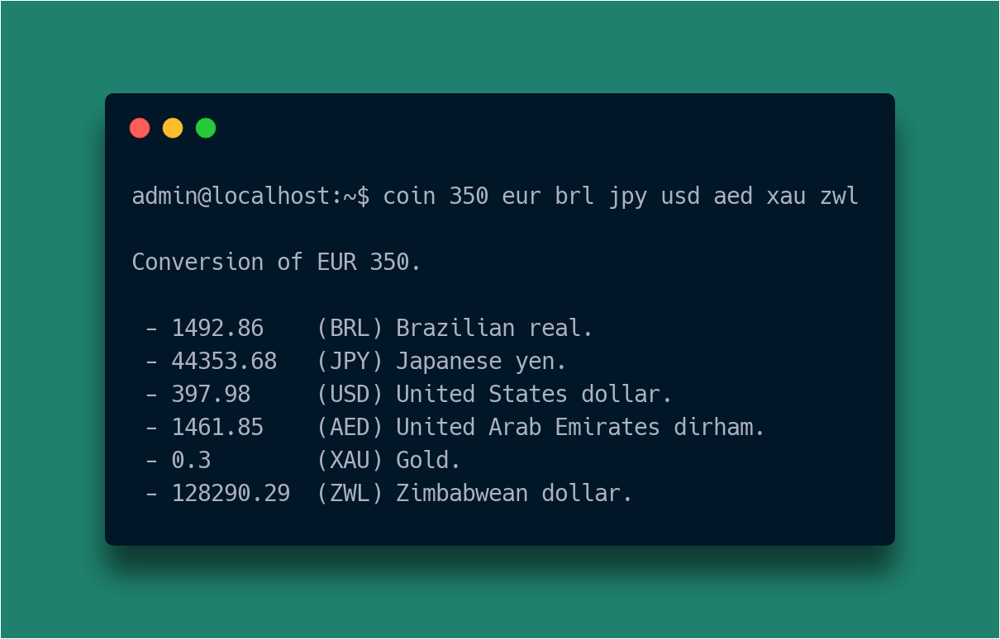

# COIN: CLI to currency conversion

`coin` is a command-line application that performs currency conversion via the
[Fixer API][fixer]. It is currently able to convert monetary values up to 168
different currencies.

[ccz]: http://creativecommons.org/publicdomain/zero/1.0
[ftb]: https://forthebadge.com

[fixer]: https://fixer.io

---
